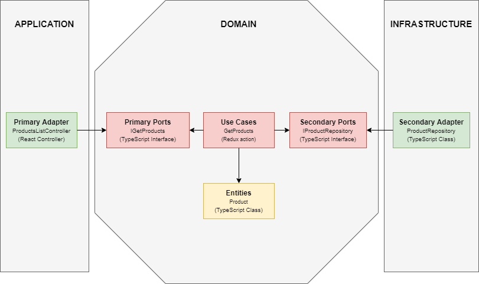

# Hexagonal Architecture

## Introduction
A simple project to use hexagonal architecture in a front-end project (React with redux).
Data is retrieved from an API
If you have any suggestions, advice, questions or remarks, do not hesitate!

## Project 
### Features implemented:
- Retrieve a shopping list with its products

### Features to implement:
- Add a product to the list
- Modify a product in the list
- Remove a product from the list

### Installation
1) Get the projet with ```git clone https://github.com/dimitridumont/hexagonal-architecture-react```
2) Install dependancies with ```yarn install```
3) Start the React application with ```yarn start```

## Hexagonal Architecture
### Schema


### Explications
The hexagonal architecture, or architecture based on ports and adapters, is an architectural pattern used in the field of software design. It aims to create systems based on application components which are loosely coupled and which can be easily connected to their software environment by means of ports and adapters. These components are modular and interchangeable, which reinforces the consistency of processing and facilitates the automation of tests.

### Resources
In english :
- [Hexagonal architecture by Alistair Cockburn](https://alistair.cockburn.us/hexagonal-architecture/)

In french :
- [Slack de Wealcome](https://wealcome.slack.com/)
- [La Clean Architecture : catalyseur de productivité](https://medium.com/@mickalwegerich/la-clean-architecture-catalyseur-de-productivit%C3%A9-68ff61aa38ff)
- [Architecture Hexagonale : trois principes et un exemple d’implémentation](https://blog.octo.com/architecture-hexagonale-trois-principes-et-un-exemple-dimplementation/)
- [Architecture Hexagonale : le guide pratique pour une clean architecture](https://beyondxscratch.com/fr/2018/09/11/architecture-hexagonale-le-guide-pratique-pour-une-clean-architecture/)

